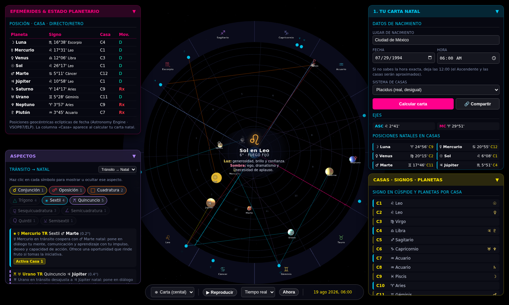

# Reloj Cósmico Geocéntrico 3D

Visor astrológico geocéntrico en 3D: representa el cosmos con la Tierra al
centro, compara tu **Carta Natal** fija con el **cielo en tránsito** en tiempo
real, y muestra exactamente **qué casas se están activando** y qué áreas de vida
impactan.

Construido sobre la versión inicial en HTML, ahora con precisión astronómica
real, sistemas de casas reales, buscador de ciudades e interacción 3D directa.



## Cómo usarlo

Abre **`index.html`** en un navegador moderno (Chrome, Firefox, Edge). No
requiere servidor ni instalación: las librerías están incluidas en `vendor/` y
funcionan también sin conexión (`file://`).

### Publicarlo en línea (GitHub Pages)

Como es un sitio estático, se publica gratis con GitHub Pages:

1. Repo → **Settings** → **Pages**.
2. En **Source** elige **Deploy from a branch**.
3. Branch: **`main`**, carpeta **`/ (root)`** → **Save**.
4. En ~1 minuto estará en `https://<usuario>.github.io/Reloj/`.

### Archivo único (opcional)

`node tools/build-standalone.mjs` genera **`reloj-standalone.html`** con todo
embebido (CSS + librerías + módulos) para compartir o abrir sin la carpeta
`vendor/`.

> El **buscador de ciudades** (geocoding) es la única función que necesita
> internet. Sin conexión puedes ingresar latitud/longitud y huso a mano.

### Flujo básico

1. Escribe tu ciudad de nacimiento y selecciónala (autocompleta lat/lon y huso).
2. Ajusta fecha y hora locales, elige el **sistema de casas** y pulsa
   **«Calcular Carta Natal & Casas»**.
3. Explora la escena: arrastra para orbitar, rueda para acercar.
   - **Pasa el cursor** sobre un planeta para ver su posición exacta.
   - **Haz clic** sobre un planeta para fijar su tarjeta interpretativa.
4. Cambia entre **Tránsitos Actuales** y **Posiciones Natales**, y usa
   **Reproducir** + velocidad para ver el cielo moverse.

## Qué se implementó

| Objetivo | Estado |
|---|---|
| **Efemérides de alta precisión** | ✅ Astronomy Engine (VSOP87 / ELP). Longitudes eclípticas geocéntricas *de fecha*, en grados-minutos-segundos, con detección real de retrogradación. |
| **Casas reales desiguales** | ✅ **Placidus** por iteración de semiarcos (validado), más **Porphyry**, **Casas Iguales** y **Signo Completo**. Ascendente y Medio Cielo calculados por longitud/latitud. |
| **Búsqueda geográfica (geocoding)** | ✅ Buscador de ciudades vía Open-Meteo → autocompleta lat/lon y zona horaria IANA. El huso convierte la hora de nacimiento a UTC respetando el horario de verano histórico. |
| **Interacción 3D (raycasting)** | ✅ Hover y clic sobre planetas natales y de tránsito despliegan una tarjeta con signo, casa activada e interpretación didáctica. |
| **Motor de interpretaciones** | ✅ Significados de planetas, signos, casas y aspectos, con lecturas diferenciadas para la **carta natal** y para los **tránsitos**. |
| **Control de tiempo** | ✅ Reproducción en tiempo real o acelerada (hora/día/semana/mes por segundo) y botón «Ahora». |
| **Guardar y compartir** | ✅ La carta se guarda en el navegador (localStorage) y se codifica en la URL: el botón «🔗 Compartir» copia un enlace que reabre tu carta ya calculada. |

### Interpretaciones (natal y tránsito)

`js/data.js` incluye un corpus original en español (no reproduce fuentes
externas) que combina la **función** de cada planeta con el **estilo** del signo
y el **ámbito** de la casa, más el carácter de cada **aspecto**:

- **Modo Natal** → tarjetas de planetas en su signo/casa y panel de **aspectos
  natales** internos (p. ej. «Sol *cuadratura* Júpiter: fricción interna que,
  bien trabajada, es un gran motor de logros»).
- **Modo Tránsito** → cada planeta en movimiento explica qué **casa natal
  activa** y su aspecto al planeta natal (p. ej. «Urano en tránsito *coopera con*
  Sol natal… activa Casa 10 · Vocación»).

Las lecturas aparecen al pasar el cursor por las tablas, al hacer clic en un
planeta 3D y en las tarjetas de aspecto.

### Precisión verificada

Las posiciones se contrastaron contra efemérides conocidas (p. ej. 29-jul-1994:
Sol 6° Leo, Saturno 11° Piscis ℞, Plutón 25° Escorpio ℞). El Ascendente/MC y las
cúspides Placidus para esos datos dan ASC ≈ 11° Leo, MC ≈ 9° Tauro con casas
desiguales coherentes.

## Estructura

```
index.html            Estructura y carga de módulos
css/style.css         Estilos de la interfaz
js/data.js            Signos, casas, planetas, aspectos e interpretaciones
js/astro.js           Núcleo astronómico: efemérides, casas, aspectos, formato
js/scene.js           Escena 3D (Three.js): rueda, planetas, casas, raycasting
js/app.js             Orquestación: estado, natal, geocoding, tiempo real, UI
vendor/               Three.js, OrbitControls y Astronomy Engine (locales)
```

## Notas y limitaciones

- El sistema **Koch** no se incluye para no mostrar cúspides potencialmente
  incorrectas; los cuatro sistemas ofrecidos están validados.
- Los **radios orbitales** de los planetas son esquemáticos (ordenados por
  distancia), no a escala; lo exacto es la **posición angular** (longitud
  eclíptica), que es lo que importa astrológicamente.
- La oblicuidad usada para las casas es la media de la fecha (diferencia
  sub-arcminuto frente a la verdadera, irrelevante a nivel visual).

## Créditos

- [Astronomy Engine](https://github.com/cosinekitty/astronomy) (MIT) — efemérides.
- [Three.js](https://threejs.org/) (MIT) — render 3D.
- [Open-Meteo Geocoding API](https://open-meteo.com/) — búsqueda de ciudades.
